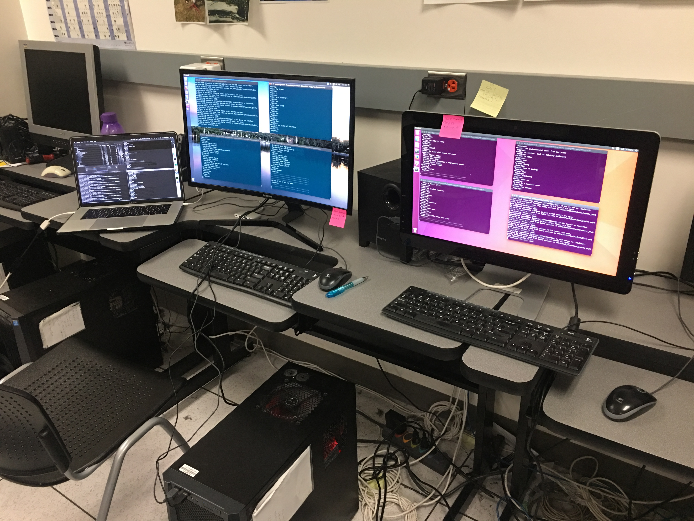
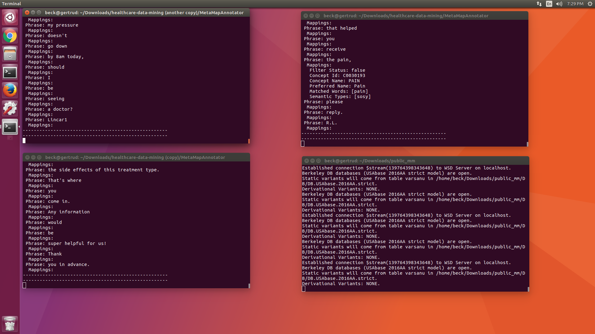
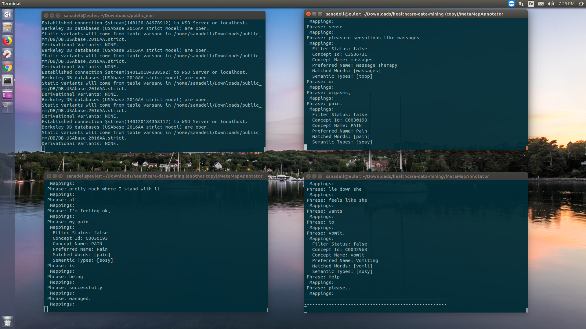

# MetaMap Annotator
This project uses MetaMap annotator Java API for annotating the web data scrapped by the scraper project.
The location of the CSV file containing the scrapped data, MetaMap options should be given in the class file.
The mmserver should be setup and running prior to running this project.

# Instructions
* Download MetaMap main release from [here](https://metamap.nlm.nih.gov/MainDownload.shtml)
* Download the MetMap Java API from [here](https://metamap.nlm.nih.gov/JavaApi.shtml)
* Extract and merge the *public_mm* folder of Java API into *public_mm* folder of main/full release. Make sure the duplicate files are ignored while merging.
* Run 
```
$ cd public_mm/
$ ./bin/install.sh
```
* Check the install.log and make sure that mmserver is generated.It should look like this
```
$ cat install.log 
./bin/install.sh started Fri Mar 29 12:12:14 MST 2019
Basedir is set to /Users/sanadell/Projects/public_mm.
Using /Library/Java/JavaVirtualMachines/jdk-10.0.2.jdk/Contents/Home for JAVA_HOME.
Setting up bin directory scripts:
/Users/sanadell/Projects/public_mm/bin/SKRenv.16 generated.
/Users/sanadell/Projects/public_mm/bin/SKRrun.16 generated.
/Users/sanadell/Projects/public_mm/bin/metamap generated.
/Users/sanadell/Projects/public_mm/bin/metamap16 generated.
/Users/sanadell/Projects/public_mm/bin/metamap2016.TEMPLATE generated.
/Users/sanadell/Projects/public_mm/bin/mmserver generated.
/Users/sanadell/Projects/public_mm/bin/mmserver16 generated.
/Users/sanadell/Projects/public_mm/bin/skrmedpostctl generated.
/Users/sanadell/Projects/public_mm/bin/testapi.sh generated.
/Users/sanadell/Projects/public_mm/bin/uninstall.sh generated.
/Users/sanadell/Projects/public_mm/bin/wsdserverctl generated.
Setting up test suite:
/Users/sanadell/Projects/public_mm/TestSuite/runTest_2009.sh generated.
/Users/sanadell/Projects/public_mm/TestSuite/runTest_2010.sh generated.
/Users/sanadell/Projects/public_mm/TestSuite/runTest_2011.bat generated.
/Users/sanadell/Projects/public_mm/TestSuite/runTest_2011.sh generated.
/Users/sanadell/Projects/public_mm/TestSuite/runTest_2012.sh generated.
/Users/sanadell/Projects/public_mm/TestSuite/runTest_2013.sh generated.
/Users/sanadell/Projects/public_mm/TestSuite/runTest_2014.sh generated.
Checking for required datafiles
Checking for optional datafiles (WSD)
MISSINGOPTIONS=0
MISSINGFILES=0
Public MetaMap Install complete.
./bin/install.sh ended Fri Mar 29 12:12:23 MST 2019
Public MetaMap basedir: /Users/sanadell/Projects/public_mm
Public MetaMap Program Dir: /Users/sanadell/Projects/public_mm/bin
Java Home dir: /Library/Java/JavaVirtualMachines/jdk-10.0.2.jdk/Contents/Home
```
* Start the WSD, MedPost and MM servers in order
```
$ ./bin/wsdserverctl start
$ ./bin/skrmedpostctl start
$ ./bin/mmserver
```
* Clone this project
* Navigate to MetaMapAnnotator folder
* Run
```
$ java -jar dist/MetaMapAnnotator.jar
```
* The input will be picked up neighbouring scraper/data folder. All csv files inside data folder(but not it's sub folders) will be taken as input by this application.
* The output will be written to resources folder under MetMapAnnotator folder.
* Run *combine.py* under resources folder to combine all the result set CSVs of WebMD, Drugs.com and Patient.info sites into one so that the **ontology** module can take it as input and load the data into the ontology database. Ouput should look something like this
```
sanadell@smac ~/NetBeansProjects/HealthCareMining/MetaMapAnnotator/resources (master)
$ python3 combine.py 
Webmd2019-04-19_02-31-05 copy 9.csv
Webmd2019-04-19_02-31-05 copy 8.csv
PatientsInfo2019-04-09_03-54-25 copy 10.csv
Webmd2019-04-19_02-31-05 copy 10.csv
Drugs2019-04-16_17-04-52 copy 1-0.csv
Drugs2019-04-16_17-04-52 copy 1.csv
PatientsInfo2019-04-09_03-54-25 copy 3.csv
PatientsInfo2019-04-09_03-54-25 copy 2.csv
Drugs2019-04-16_17-04-52 copy 2.csv
PatientsInfo2019-04-09_03-54-25 copy 1.csv
Drugs2019-04-16_17-04-52 copy 3.csv
Drugs2019-04-16_17-04-52 copy 7.csv
PatientsInfo2019-04-09_03-54-25 copy 5.csv
PatientsInfo2019-04-09_03-54-25 copy 4.csv
Drugs2019-04-16_17-04-52 copy 6.csv
Drugs2019-04-16_17-04-52 copy 4.csv
PatientsInfo2019-04-09_03-54-25 copy 6.csv
PatientsInfo2019-04-09_03-54-25 copy 7.csv
Drugs2019-04-16_17-04-52 copy 5.csv
Drugs2019-04-16_17-04-52 copy 8.csv
Drugs2019-04-16_17-04-52 copy 9.csv
Drugs2019-04-16_17-04-52 copy 10.csv
PatientsInfo2019-04-09_03-54-25 copy 9.csv
PatientsInfo2019-04-09_03-54-25 copy 8.csv
PatientsInfo2019-04-09_03-54-25 copy 1-0.csv
Webmd2019-04-19_02-31-05 copy 1.csv
Webmd2019-04-19_02-31-05 copy 3.csv
Webmd2019-04-19_02-31-05 copy 2.csv
Webmd2019-04-19_02-31-05 copy 6.csv
Webmd2019-04-19_02-31-05 copy 7.csv
Webmd2019-04-19_02-31-05 copy 5.csv
Webmd2019-04-19_02-31-05 copy 4.csv
Combined CSV file successfully created

```

# Known Issues
1. The *mmserver* crashes when a post in the csv file being fed contains non ASCII characters<br>
Solution: Just remove the culprit post from input and run the application again.

# Notes
* For the list of all options beings passed to metamap, check the options list in the main class file of this project. Care is taken that these options won't cause significant delays while processing without losing accuracy. This includes the list of semantic types being filtered out.
* For the list of stop words being ignored check IgnoredWrords.csv file under resources.
* The code for detailed printing is commented out to ensure high speed run on large dataset.
* The code for filtering concepts based on POS tags specified in IncludePOSTags.csv(under resources folder) is commented out to recognise all the  concepts rather than accuracy since only the top frequent sets will be returned by the search.
* Since the MetaMap processing is slow we can start multiple instances of the application. Here is how it looks like



